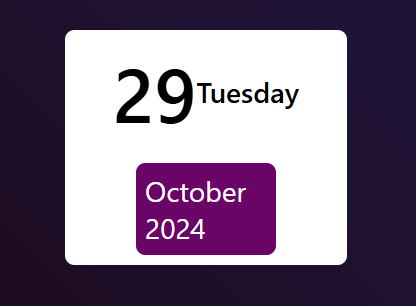

# Mini Calendar

A simple mini calendar built with HTML, CSS, and JavaScript.

## Features

- Shows the current date, day of the week, month, and year.
- Highlights the current day of the week for easy reference.

[**Live Demo**](https://toqaezzatly.github.io/mini-calendar/)

